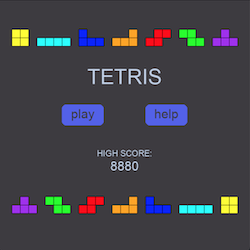
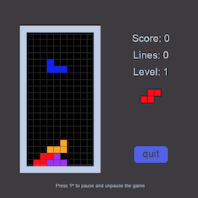
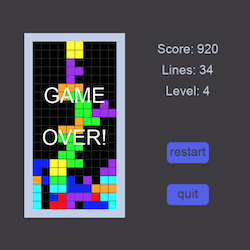
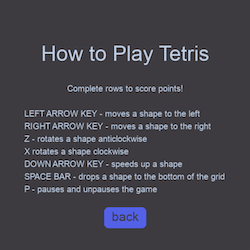

# Tetris

### A simple Tetris game built with Pygame.

This is a response to John Crickett's Build Your Own Tetris Challenge.

See the challenge specification [here](https://codingchallenges.fyi/challenges/challenge-tetris).

### Getting Started
- Install Pygame `pip install pygame`
- Run main.py

